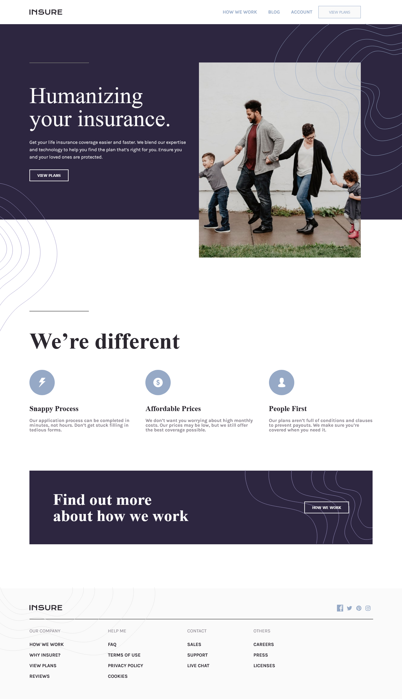
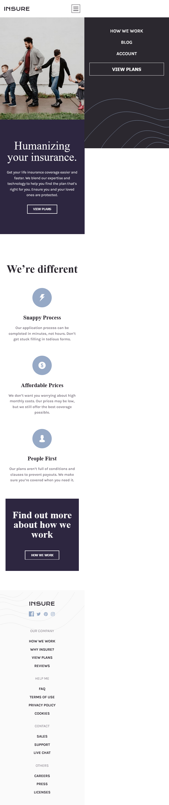

# Frontend Mentor - Insure landing page solution

This is a solution to the [Insure landing page challenge on Frontend Mentor](https://www.frontendmentor.io/challenges/insure-landing-page-uTU68JV8). Frontend Mentor challenges help you improve your coding skills by building realistic projects. 

## Table of contents

- [Overview](#overview)
  - [The challenge](#the-challenge)
  - [Screenshot](#screenshot)
  - [Links](#links)
- [My process](#my-process)
  - [Built with](#built-with)
  - [What I learned](#what-i-learned)
  - [Continued development](#continued-development)
  


## Overview

### The challenge

Users should be able to:

- View the optimal layout for the site depending on their device's screen size
- See hover states for all interactive elements on the page

### Screenshot



##




### Links

- Video URL introducing the project.: [click here](https://www.linkedin.com/posts/gracilianobarroso_e-a%C3%AD-pessoal-mais-um-projeto-conclu%C3%ADdo-ugcPost-6986759349930995712-4h38?utm_source=share&utm_medium=member_desktop)
- Live Site URL: [click here](https://graciliano-barroso.github.io/insure_landing_page/)

## My process

### Built with

- Semantic HTML5 markup
- CSS custom properties
- Flexbox
- Mobile-first workflow
- [JavaScript](https://developer.mozilla.org/pt-BR/docs/Web/JavaScript) - JS library

### What I learned

One of the things I learned in this project was the application of a property called z-index and another was to make a menu with animation changing with the click from menu amburger to X to close.

Below I will leave examples of the two things I learned:

This one about the z-index:

```html

```
```css
.ripples-right-desktop {
    z-index: 1;
    position: absolute;
    right: 0px;
    top: 81px;
}
```
And this one about the animated menu:

```html
<div id="toggle"></div>
```
```css
#toggle {
    position: relative;
    width: 35px;
    height: 35px;
    background-color: var(--Very-Light-Gray);
    border: 1px solid var(--Very-Dark-Violet);
    cursor: pointer;
    display: flex;
    justify-content: center;
    align-items: center;
    transition: 0.2s;
}    

#toggle::before {
    content: '';
    position: absolute;
    width: 22px;
    height: 2px;
    background-color: var(--Very-Dark-Violet);
    transition: 0.5s;
    transform: translatey(-8px);
    box-shadow: 0 8px 0 var(--Very-Dark-Violet);
}

#toggle.active::before {
    transform: translatey(0px) rotate(45deg);
    box-shadow: 0 0 0 var(--Very-Dark-Violet);
}

#toggle::after {
    content: '';
    position: absolute;
    width: 22px;
    height: 2px;
    background: var(--Very-Dark-Violet);
    transition: 0.5s;
    transform: translatey(8px);
}

#toggle.active::after {
    transform: translatey(0px) rotate(-45deg);
}
```

```js
let toggle = document.getElementById('toggle');
toggle.addEventListener('click', ()=>{
    toggle.classList.toggle('active');
});
```
### Continued development

I still intend to continue appreciating HTML and CSS, because I realize that I still need to better understand some relations between HTML and CSS, but I already feel comfortable working with them.

Regarding Javascripts, I intend to continue increasing my knowledge so that in the future I can be more comfortable when creating codes.
